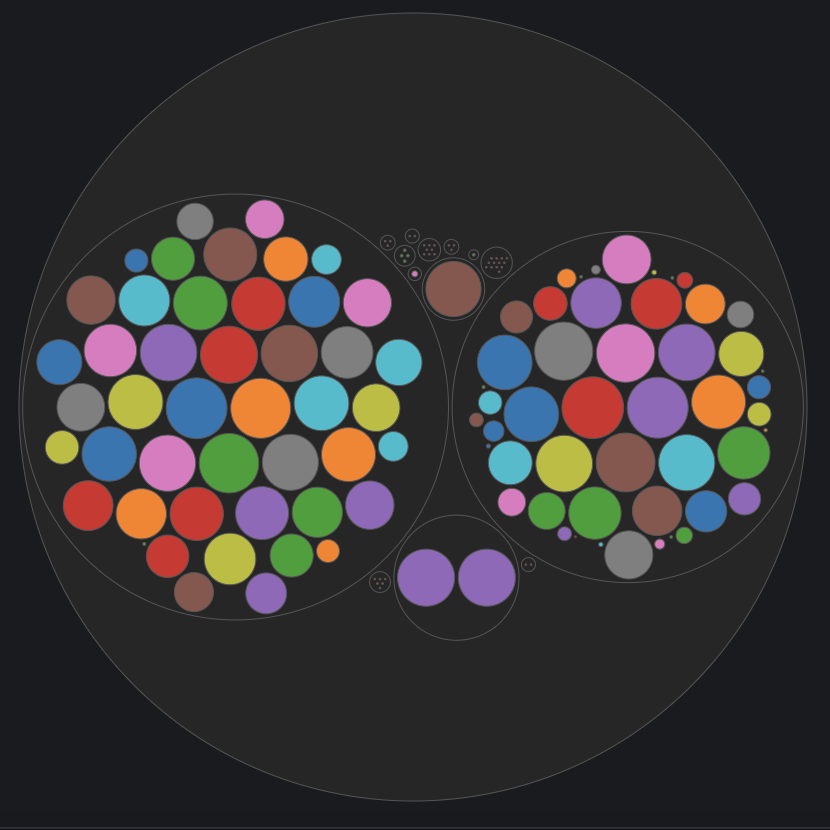

## Bubble Chart Panel Plugin for Grafana
This panel is meant to have a centralized view of any component in the form of a bubble chart. Circles are grouped together into clusters based on tag values and circle size and color represents the aggregated value of time series data.

### Grouping
Circles are grouped in multiple clusters as per alias format. Multiple tag values seperated by a group seperator in alias field define chart hierarchy and grouping. For e.g. '$tag_dc,$tag_host' or 'DataCenter: $tag_dc, Host: $tag_host' will group all hosts under each data center circle. By default comma is a group seperator which can be changed under 'Options' tab. 

### Options

###
* Stat - Aggregate data same as singlestat panel.
* Unit - Formats same as singlestate panel. Mouse hover on any circle will display the formatted value.
* Display label - Enable/Disable the text display within circle.
* Group Seperator - Tag values seperator in Alias for grouping. 
* Color Schemes - Multiple color schemes.
    * Group - In grouping scheme, circles are colored as per their grouping.
        * Colors -  Start and end range of colors for group hierarchy.
    * Threshold - In threshold scheme, circles are colored as per threshold values.
        * Thresholds - Threshold values.
        * Colors - Colors for different threshold values.
    * Gradient - In gradient scheme, circles are colored as per component value.  
        * Thresholds - Threshold values.
        * Colors - Colors for gradient scale.
    * Unique - In unique scheme, different colors categories are applied to circles.

### Supported Databases:
Tested against following databases.  
* [OpenTSDB](http://opentsdb.net/)
* [Bosun](http://bosun.org/)

Hopefully it would work with other databases also.

### Screenshots: Different color schemes
      

### Release Notes